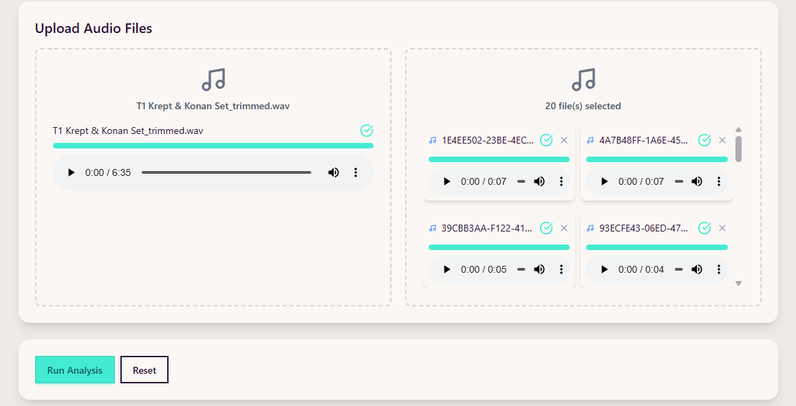
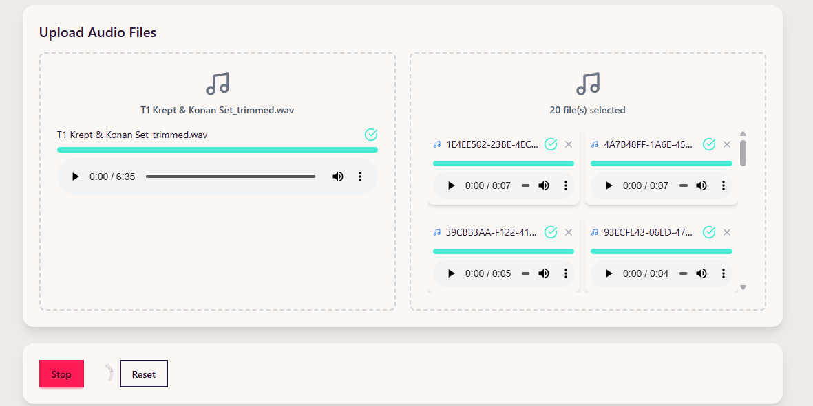
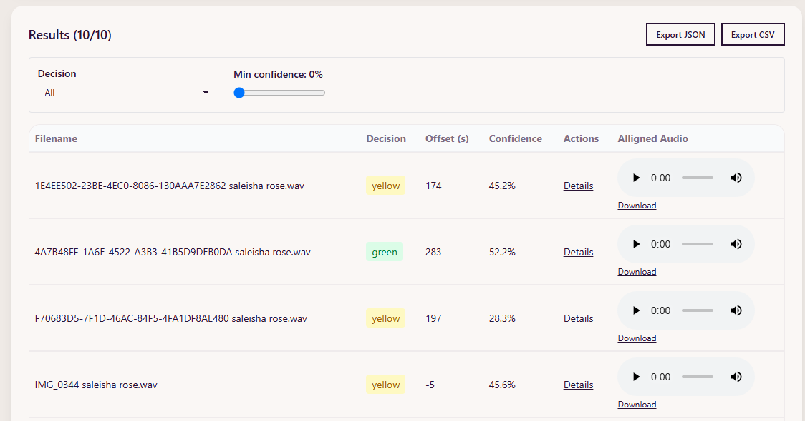
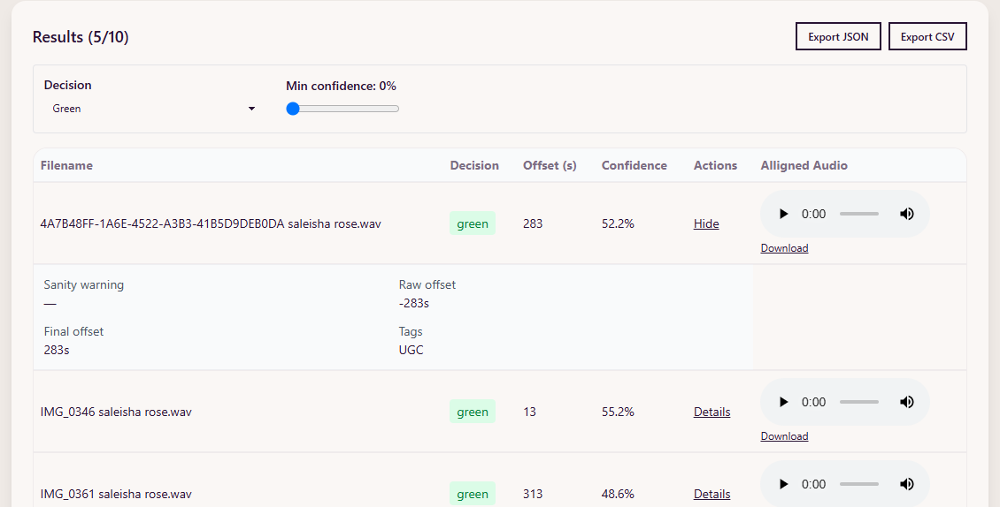
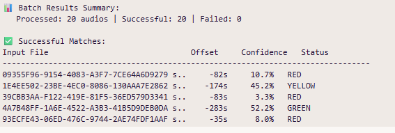

# 🎧 Audio Offset Explorer

## A simple and easy to interact Web UI that finds the offset of an audio within another file

### Overview of the project

**Audio Offset Explorer** is a small full-stack application that wraps an existing **audio offset engine** (`Match.py`) and provides a simple web UI with Next.js and Typescript to **analyze and visualize alignment** between a reference audio file(The main or full audio file) and multiple candidate tracks(short audio clips that might have been cut out from the full clip).

For a non-technical user, Imagine having a short audio clip and you want to know if and where that clip appears inside a longer or the official recording (the “reference” track). This project automates that job and presents the results in an interactive web page.

### End goal explained

- runs an automatic comparison between many clips and a chosen reference,

- figures out if each clip matches the reference, how many seconds it is offset (where it lines up), and how confident the program is about that match

  - **Offset** (seconds, candidate relative to reference)
  - **Confidence** (0–100%)
  - **Decision status** (green / yellow / red)

- presents the results in a table and produces simple reports (JSON/CSV) users cna use or share

---

## ⚡ Requirements

- Python 3.8+
- FFmpeg installed and on system PATH
- Node.js 18+
- Recommended: Virtualenv for Python

---

## 🧪 Features

- Batch processing of candidate audio files
- Progressive audio matching for more accurate results
- JSON output containing offsets, confidences, decisions, and warnings
- Simple frontend UI with:
  - Run Analysis button
  - Filterable results table
  - Detail view for each result
- Optional CSV/JSON export

---

## Running this project/ Setup instruction

To get this project up and running start by having Python and node.js installed on your computer. It's advised you create a virtual environment at the root folder to store your projects dependencies separately. You can install virtualenv with

```bash
pip install virtualenv
```

Clone or download this repository and open it in your editor of choice. In a terminal (mac/linux) or windows terminal, run the following command in the base directory of this project

```bash
virtualenv env
```

That will create a new folder env in your project directory. Next activate it with this command:

```bash
# on Mac/linuz
source env/bin/active
# on windows
venv\Scripts\activate
```

### Python Engine (CLI) run instruction

Run the tool or python script directly from terminal to process audio files:

```bash
cd backend
```

Then install the project dependencies with

```bash
pip install -r requirements.txt
```

Now you can run the project with this command

```bash
python Match.py --audio-dir ./candidates --unified ./reference.wav  --output-dir ./process --export audio
```

**Note**:

- `--audio-dir` : directory of candidate audio files
- `--unified` : single reference audio file
- `--export-audio` : save aligned audio output
- `--output-dir` : directory for reports (default: `processed_files`)

Output includes:

- `offsets_<ref>.json` — compact report
- `export_detailed_<ref>_<timestamp>.json` — full report

---

## 🧭 Web Application Usage

### 1. Install dependencies

```bash
# if in backend directory move to the root directory
cd ..

# Frontend dependencies
cd web
npm install

```

### 2. Run the Next.js development server

```bash
cd frontend
npm run dev
```

### 3. Trigger an analysis

Open the browser at [http://localhost:3000](http://localhost:3000)

---

## 🧪 Sample Run

Upload Reference and Candidate files then click **“Run Analysis”** to start the engine.



Button to stop and reset process is considered



Results will be displayed in a table with:

- Filename
- Decision (green/yellow/red)
- Offset (s)
- Confidence (%)



Optional:

- Expand row to see raw offset, warnings, and thresholds.
- Filter by decision or confidence level.



---

## 📤 API Endpoint

**`POST /api/analyze`**  
Triggers the Python CLI and returns a structured JSON response.

Example response:

```json
{
  "unified_reference": {
    "reference_name": "T1 Krept & Konan Set_trimmed.wav",
    "is_audio_only": true,
    "trimmed_rel": null,
    "duration": 395.008,
    "analysis_audio_rel": "T1 Krept & Konan Set_trimmed.wav",
    "metadata": {}
  },
  "generated_at": "2025-10-17T02:56:55Z",
  "base_dir": "T1_Krept___Konan_Set_trimmed",
  "items": [
    {
      "source_file": "1E4EE502-23BE-4EC0-8086-130AAA7E2862 saleisha rose.wav",
      "decision": "yellow",
      "accepted": false,
      "confidence": 45.2,
      "final_offset_seconds": 174,
      "signed_offset_seconds": -174,
      "aligned_video_rel": null,
      "aligned_audio_rel": "1E4EE502-23BE-4EC0-8086-130AAA7E2862 saleisha rose_aligned_off-174.wav",
      "metadata": {
        "tags": ["UGC"]
      },
      "durations": {
        "original": 7.4289375,
        "final": 7.0
      }
    }
  ]
}
```

---

### 🧪 Sample Run CLI

```bash
python Match.py   --audio-dir sample_data/candidates   --unified sample_data/reference.wav   --export-audio --verbose
```



---

## 🏆 Stretch Goals

- Real-time log streaming to frontend
- Audio playback of aligned tracks
- CSV/JSON export
- Confidence filtering

---

## 🧭 Example JSON Export Output

```json
{
  "reference": "T1 Krept & Konan Set_trimmed.wav",
  "generatedAt": "2025-10-17T02:56:55Z",
  "total": 10,
  "results": [
    {
      "filename": "1E4EE502-23BE-4EC0-8086-130AAA7E2862 saleisha rose.wav",
      "decision": "yellow",
      "offset": 174,
      "confidence": 45.2,
      "raw_offset": -174,
      "tags": ["UGC"],
      "aligned_audio_rel": "/api/aligned/T1_Krept___Konan_Set_trimmed/1E4EE502-23BE-4EC0-8086-130AAA7E2862%20saleisha%20rose_aligned_off-174.wav"
    }
  ]
}
```


---

## How to tweak this project for your own uses
the diagram below shows the folder/file structure and thier function

```bash
web/
│
├── app/ # Next.js App Router pages and APIs
│ ├── analyze/ # Main backend API endpoint for analysis
│ │ └── route.ts
│ ├── stop/ # API to stop a running Python process
│ │ └── route.ts
│ ├── stream/ # SSE log streaming API
│ │ └── route.ts
│ ├── api/aligned/[...path]/route.ts # Serves aligned audio files dynamically
│ ├── layout.tsx
│ ├── globals.css
│ └── page.tsx # Main single-page UI
│
├── src/
│ ├── components/ # Reusable UI components
│ │ ├── AudioUploader.tsx
│ │ ├── FileUpload.tsx
│ │ ├── Filters.tsx
│ │ └── ResultsTable.tsx
│ ├── utils/ # Helper functions (e.g., export utils)
│ └── types/ # TypeScript types (e.g., AnalysisResult)
│
├── backend/ # Python CLI scripts (runs the actual processing)
│
├── public/ # Static assets (optional)
│
├── package.json
├── next.config.ts
├── tailwind.config.js
└── README.md
```

When facing unexpected errors, check:

- Backend logs in the terminal.

- Network tab in DevTools for failed requests.

- processed/ folder to ensure Python actually created files.
---

## 🧠 Development Notes — Challenges & Solutions

### 1. **FFmpeg Not Detected on Some Machines**

- **Issue:** The Python engine failed with `❌ FFmpeg not found or not working`.
- **Cause:** FFmpeg wasn’t installed or not added to the system’s PATH or not properly installed .
- **Solution:** Added a `check_ffmpeg()` pre-run check that provides a clear error message and installation instructions.

### 2. **Stop button did not actually kill Python process**

- **Issue:** The Stop button stopped the frontend, but Python script kept running in the background..
- **Cause:** Only frontend state was reset; Python process was not terminated.
- **Solution:** 
    - Implemented processManager.ts to track the active process and kill it with SIGKILL
    - Created /api/analyze/stop route to trigger the stop process.

### 3. **Aligned audio files not appearing in UI for Display**

- **Issue:** Results showed "No aligned audio" to display or download audi clip of each aligned audio.
- **Cause:** 
    - The audio file was not exported from the script written int the frontend to trigger the python engine 
    - The frontend was looking for files in public/aligned but Python saved them in processed/.
- **Solution:**
    - Implemented /api/aligned/[...path] to serve audio directly from processed/.
    - addedd "--export-audio"e python to the python script
    - Adjusted analyze/route.ts to build aligned URLs correctly.

### 4. **Error toast not disappearing automatically**

- **Issue:** Error messages stayed on screen until a new action happened..
- **Cause:** Unhandled exceptions for bad inputs.
- **Solution:** 
    - Added a useEffect hook to clear error after 5 seconds:
    - added a cacel button that setError to Null

### 5. **Python script not found / timeout error**

- **Issue:** API returned Python script failed or process stopped unexpectedly.
- **Cause:** Python script path was incorrect, or timeout killed the process.
- **Solution:** 
    - Ensured the backend path pointed to ../backend/match.py.
    - Increased timeout duration.
    - Used setProcess and clearProcess properly to manage running Python processes.


